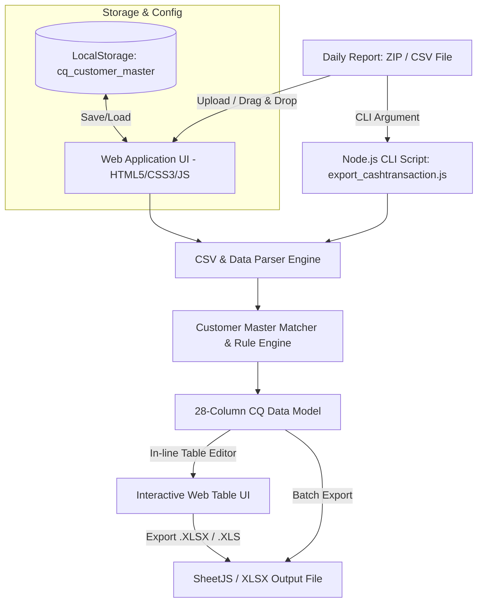

# LHSEC Global Trading - CashTransaction Reformat System (CQ Export)
## เอกสารข้อกำหนดระบบและคู่มือสำหรับการพัฒนาระบบ (System Specification & Development Guide)

---

### 1. บทนำและวัตถุประสงค์ (System Overview & Objectives)

ระบบ **LHSEC CashTransaction Exporter (CQ Format)** พัฒนาขึ้นสำหรับสายงาน **Global Trading (LH Securities - LHSEC)** เพื่อแก้ไขปัญหาและลดระยะเวลาการทำงานแบบ Manual ในการแปลงข้อมูลรายงานการทำธุรกรรมประจำวัน (Daily Cash Transaction Reports เช่น `*_cash_transaction_data.csv` จากไฟล์ ZIP) ให้อยู่ในโครงสร้างมาตรฐาน 28 คอลัมน์ของระบบ **CQ Back-Office** ในรูปแบบไฟล์ Excel (`CashTransaction_YYYYMMDD.xlsx` / `.xls`)

#### เป้าหมายหลัก:
1. **ลดข้อผิดพลาด (Zero Human Error)** จากการก็อปปี้และจัดเรียงคอลัมน์ด้วยมือ
2. **ความรวดเร็วและเป็นอัตโนมัติ (Automation & Speed)** รองรับการประมวลผลไฟล์ ZIP/CSV ภายในไม่กี่วินาที
3. **การจับคู่ข้อมูลลูกค้าอัตโนมัติ (Intelligent Customer Master Mapping)** จับคู่ `Customer No` / `External Ref No` กับชื่อภาษาไทย/อังกฤษ และเลขบัญชี B2B
4. **ความยืดหยุ่นในการใช้งาน (Hybrid Workflow)** รองรับทั้งหน้าจอเว็บแอปพลิเคชัน (Web UI Interactive Editor) และการรันคำสั่งอัตโนมัติผ่าน Command Line (Node.js CLI)

---

### 2. สถาปัตยกรรมระบบและเทคโนโลยี (System Architecture & Tech Stack)



#### เทคโนโลยีที่ใช้ (Technology Stack):
* **Frontend Web App**:
  * **HTML5 & Vanilla CSS3**: สไตล์ Dark Modern Dashboard, รองรับ Responsive Design, Glassmorphism, Custom Typography (Google Fonts: Prompt & Inter)
  * **Vanilla ES6+ JavaScript**: ประมวลผลแบบ Client-side 100% ปลอดภัย ไม่ต้องส่งข้อมูลทางการเงินออกนอกเครื่อง (No Data Leak)
  * **SheetJS (xlsx.full.min.js)**: จัดการสร้างและเขียนไฟล์ Excel กำหนด Number Format และ Column Widths ตามมาตรฐาน CQ
  * **JSZip (jszip.min.js)**: แตกไฟล์และค้นหาไฟล์ `*cash_transaction*.csv` ภายใน ZIP อัตโนมัติ
* **CLI Automation**:
  * **Node.js**: สคริปต์ standalone สำหรับประมวลผลไฟล์ผ่าน Command-line / Batch script

---

### 3. โครงสร้างข้อมูลมาตรฐาน 28 คอลัมน์สำหรับระบบ CQ (CQ 28-Column Standard Data Specification)

| ลำดับ (No.) | ชื่อคอลัมน์ (Column Header) | ชนิดข้อมูล (Data Type) | ค่าเริ่มต้น / กฎการประมวลผล (Default / Logic) | ตัวอย่างข้อมูล |
|:---:|:---|:---:|:---|:---|
| 1 | **No** | Integer | ลำดับที่ของรายการ (1, 2, 3, ...) | `1` |
| 2 | **Account No** | String | เลขที่บัญชีลูกค้า (ดึงจาก `external_ref_no` หรือ `account_no`) | `800001` |
| 3 | **Sub Account No** | String | ซับบัญชีลูกค้า (โดยปกติจะเหมือนกับ Account No) | `800001` |
| 4 | **B2B Code** | String | รหัส B2B โบรกเกอร์ต่างประเทศ (Default: `GTN`) | `GTN` |
| 5 | **B2B Account No** | String | เลขที่บัญชี B2B (จาก Customer Master หรือ Default: `ASI374219405`) | `ASI374219405` |
| 6 | **B2B Sub Account No** | String | เลขซับบัญชี B2B (Default: Account No) | `800001` |
| 7 | **First Name** | String | ชื่อลูกค้า (ภาษาไทย หรือ อังกฤษ จาก Customer Master) | `มานะ` / `PEI-FEN` |
| 8 | **Last Name** | String | นามสกุลลูกค้า (จาก Customer Master) | `เอื้ออภิสิทธิ์` / `CHE` |
| 9 | **Trans Date** | String | วันที่ทำรายการ รูปแบบ `YYYYMMDD` (ตัดเวลาออก) | `20260828` |
| 10 | **Effective Date** | String | วันที่มีผล รูปแบบ `YYYYMMDD` | `20260828` |
| 11 | **Value Date** | String | วันที่คิดมูลค่า รูปแบบ `YYYYMMDD` (ดึงจาก `value_date`) | `20260828` |
| 12 | **Transaction Type** | String | รหัสประเภทธุรกรรม (`AW`, `AD`, `CD`, `CW`, `CCA`) | `AW` |
| 13 | **Description** | String | รายละเอียดธุรกรรม (คำนวณอัตโนมัติสำหรับเงินปันผล/ภาษี) | `Tax on Cash Dividends for 1300.00000000 shares...` |
| 14 | **Company Code** | String | รหัสบริษัท (เว้นว่างตาม Format CQ) | ` ` |
| 15 | **Format** | String | รูปแบบ (เว้นว่างตาม Format CQ) | ` ` |
| 16 | **CCY** | String (3) | สกุลเงิน ตัวพิมพ์ใหญ่ 3 ตัวอักษร (`THB`, `VND`, `USD`, `HKD` ฯลฯ) | `VND` |
| 17 | **FCD Account** | String | เลขบัญชี FCD (ถ้ามี) | ` ` |
| 18 | **Amount** | Number (2) | จำนวนเงิน (บังคับทศนิยม 2 ตำแหน่ง Format `0.00`) | `0.00` / `150.50` |
| 19 | **Bank Charge** | Number | ค่าธรรมเนียมธนาคาร | ` ` |
| 20 | **CCY Purchase** | String (3) | สกุลเงินที่ซื้อ (กรณีแปลงค่าเงิน) | ` ` |
| 21 | **FCD Account Purchase** | String | บัญชี FCD ที่ซื้อ | ` ` |
| 22 | **Amount Purchase** | Number (2) | จำนวนเงินที่ซื้อ | ` ` |
| 23 | **Bank Charge Purchase**| Number | ค่าธรรมเนียมการซื้อ | ` ` |
| 24 | **FX Rate** | Number | อัตราแลกเปลี่ยน | ` ` |
| 25 | **FX CCY** | String | สกุลเงิน FX | ` ` |
| 26 | **Ref No** | String | เลขที่อ้างอิง (ดึงจาก `transaction_id` หรือ `related_transaction_id`) | `1787922256990` |
| 27 | **Status** | String (1) | สถานะรายการ (Default: `A` = Active) | `A` |
| 28 | **Remark** | String | หมายเหตุ (`NoN TAX`, `WHT TAX` ฯลฯ) | `NoN TAX` |

---

### 4. กฎทางธุรกิจและการแปลงข้อมูล (Business Rules & Transformation Logic)

#### 4.1 การจัดหมวดหมู่ประเภทธุรกรรม (Transaction Code Mapping)
1. **กรณีเงินปันผล / ภาษีเงินปันผล (Dividend & Withholding Tax - DEPDIV / AW)**:
   * เมื่อ `txn_code` = `DEPDIV` หรือ `narration` มีคำว่า `dividend`:
     * ตั้งค่า `Transaction Type` = **`AW`** (Adjust Dividend Tax)
     * ตรวจสอบค่า `vat_amount`:
       * หาก `vat_amount` = 0 หรือเป็นค่าว่าง:
         * ตั้งค่า `Remark` = **`NoN TAX`**
         * ตั้งค่า `Amount` = **`0.00`**
       * หาก `vat_amount` > 0:
         * ตั้งค่า `Remark` = **`WHT TAX`**
         * ตั้งค่า `Amount` = ค่า `vat_amount` (ทศนิยม 2 ตำแหน่ง)
     * การสร้างคำอธิบาย (`Description`):
       * นำ `eligible_shares` (จำนวนหุ้นปันผล) มาจัดรูปแบบทศนิยม 8 ตำแหน่ง
       * ดึง `Symbol` และ `ISIN` จาก `narration`
       * Format ตัวอย่าง: `Tax on Cash Dividends for {shares} shares of {symbol} ({isin}) @ 0.00000000% tax rate, On {txnDate}`
2. **กรณีฝากเงิน (Cash Deposit - CD)**:
   * ตั้งค่า `Transaction Type` = **`CD`**, `Description` = `Cash Deposit`, `Remark` = ` `
3. **กรณีถอนเงิน (Cash Withdrawal - CW)**:
   * ตั้งค่า `Transaction Type` = **`CW`**, `Description` = `Cash Withdrawal`, `Remark` = ` `
4. **กรณีแปลงสกุลเงิน (Convert Currency Add - CCA)**:
   * ตั้งค่า `Transaction Type` = **`CCA`**, `Description` = `Convert Currency (Add)`, `Remark` = ` `

#### 4.2 ฐานข้อมูลลูกค้า (Customer Master Mapping)
ระบบมีค่า Default Customer Master และสามารถแก้ไข/เพิ่ม/ลบผ่านหน้าต่าง Modal และบันทึกลง `localStorage` (`cq_customer_master`):

| Account No | B2B Account No | First Name | Last Name | Alias / Ref |
|:---|:---|:---|:---|:---|
| `800001` | `ASI374219405` | มานะ | เอื้ออภิสิทธิ์ | `ASI672238444` |
| `012147` | `ASI374219405` | PEI-FEN | CHE | - |
| `001754` | `ASI374219405` | อนันต์ | จิตตวานิชย์ | - |
| `800005` | `ASI374219405` | พัศวีร์ | อัศวกิจ | - |

---

### 5. โครงสร้างโฟลเดอร์โครงการ (Project Directory Structure)

```
c:/Users/0005/Online uxui_OpenAccout_LHSEC/ReformatToGobal/
├── index.html                   # หน้าจอหลัก Web Application UI
├── export_cashtransaction.js    # Node.js CLI Script สำหรับ Batch/Command-line
├── css/
│   └── style.css                # ดีไซน์และชุดรูปแบบ UI (LHSEC Dark Theme)
├── js/
│   ├── app.js                   # Business Logic, Data Parser, Event & Storage Handler
│   ├── xlsx.full.min.js         # Library สำหรับสร้างไฟล์ Excel (SheetJS)
│   └── jszip.min.js             # Library สำหรับแยกไฟล์ ZIP ในเบราว์เซอร์
├── datatranfrom/                # โฟลเดอร์เก็บไฟล์ตัวอย่างและผลลัพธ์
└── SYSTEM_DEVELOPMENT_SPEC.md   # เอกสารข้อกำหนดระบบนี้
```

---

### 6. คู่มือการใช้งานระบบ (User & Operator Guide)

#### วิธีการใช้งานผ่าน Web Browser:
1. เปิดไฟล์ `index.html` ใน Google Chrome, Microsoft Edge หรือเบราว์เซอร์มาตรฐาน
2. **การนำเข้าไฟล์**:
   * ลากไฟล์ `.csv` หรือ `.zip` (เช่น `2026_08_28_reports.zip` หรือ `2026_08_28_cash_transaction_data.csv`) มาวางในกรอบ **Dropzone** ทางด้านซ้าย
   * หรือคลิกเพื่อเลือกไฟล์จากคอมพิวเตอร์
3. **การตรวจสอบและแก้ไขข้อมูล**:
   * ข้อมูลจะถูกแปลงและแสดงผลในตาราง 28 คอลัมน์ทันที
   * สามารถคลิกแก้ไขช่องใดๆ ในตารางได้โดยตรง (เช่น ปรับแก้ Amount, Account No, Remark)
   * หากต้องการเพิ่มแถวใหม่ สามารถกดปุ่ม **`+ เพิ่มแถวใหม่`**
4. **การจัดการ Customer Master**:
   * คลิกปุ่ม **`👥 จัดการ Master ลูกค้า`** ด้านซ้ายเพื่อเพิ่ม/แก้ไขเลขที่บัญชีและชื่อลูกค้า
   * กด **`บันทึกข้อมูล (Save)`** ข้อมูลจะถูกบันทึกลงในเครื่องของผู้ใช้ถาวร
5. **การส่งออกไฟล์ (Export)**:
   * คลิกปุ่ม **`📊 Export .XLSX`** หรือ **`📋 Export .XLS`**
   * ระบบจะตั้งชื่อไฟล์ให้อัตโนมัติเป็น `CashTransaction_YYYYMMDD.xlsx` ตามวันที่ของธุรกรรม

#### วิธีการใช้งานผ่าน Node.js CLI:
```bash
# ประมวลผลไฟล์ CSV โดยตรง
node export_cashtransaction.js "s:/Global_T/Customer_F_CQ_Excel/08/2026_08_28_reports/2026_08_28_cash_transaction_data.csv"

# ระบุโฟลเดอร์ปลายทางสำหรับเซฟไฟล์
node export_cashtransaction.js "input_file.csv" "C:/OutputFolder"
```

---

### 7. แผนการพัฒนาและฟีเจอร์ในอนาคต (Development Roadmap)

- [ ] **Phase 1 (Data Validation & Integrity Checks)**:
  - เพิ่มระบบตรวจเช็กความถูกต้องอัตโนมัติ (เช่น แจ้งเตือนสีแดงเมื่อเลข Account No ไม่มีอยู่ใน Master, ตรวจสอบผลรวมยอดเงิน)
- [ ] **Phase 2 (Automated Folder Watcher)**:
  - สร้าง Background Daemon Service คอยสแกนโฟลเดอร์ Network Share (`S:/Global_T/...`) เมื่อมีรายงานใหม่เข้ามา ให้แปลงเป็น CQ Excel และบันทึกลงโฟลเดอร์ปลายทางทันที
- [ ] **Phase 3 (Multi-Product & Report Support)**:
  - รองรับการแปลงรายงาน Order Execution (`*_order_execution_data.csv`)
  - รองรับการแปลงรายงาน Corporate Action / Stock Dividend
- [ ] **Phase 4 (Database & REST API Integration)**:
  - เชื่อมต่อ API กลางของ LHSEC เพื่อดึง Customer Master ล่าสุดแบบ Real-time แทนการใช้ Local Storage
  - บันทึก Audit Log บันทึกประวัติการ Export ของผู้ใช้งานแต่ละคน

---
*เอกสารนี้จัดทำขึ้นสำหรับการพัฒนาและบำรุงรักษาระบบ LHSEC Global Trading Reformat Tool.*
